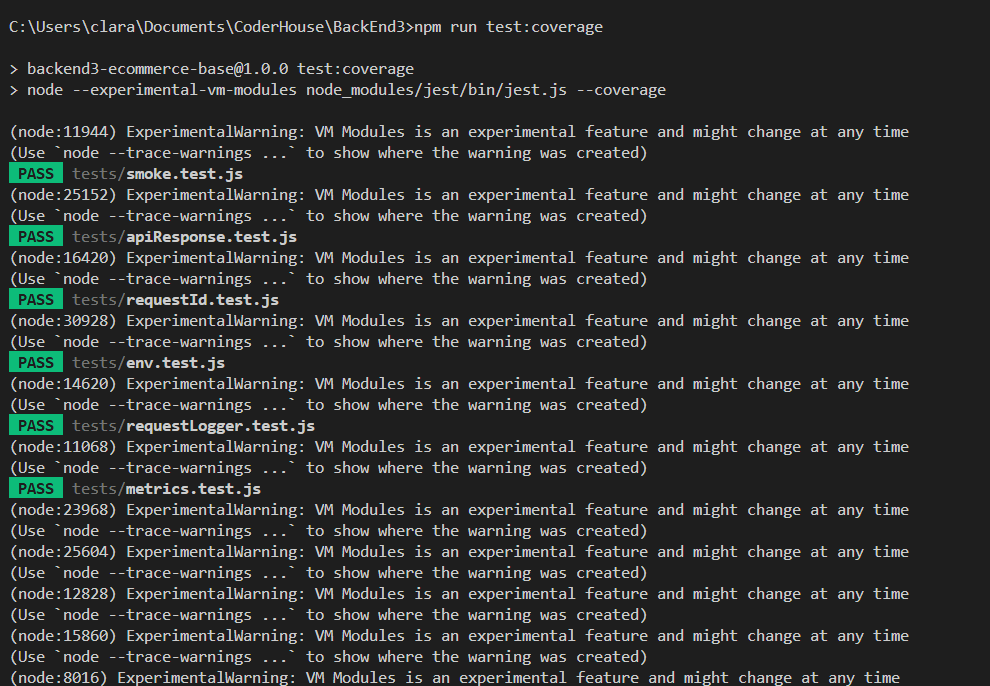
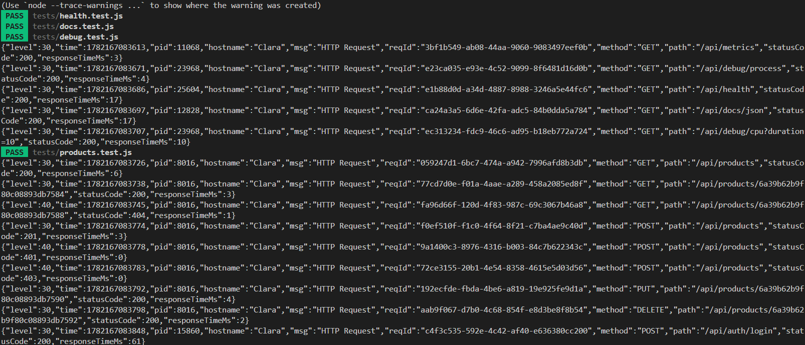
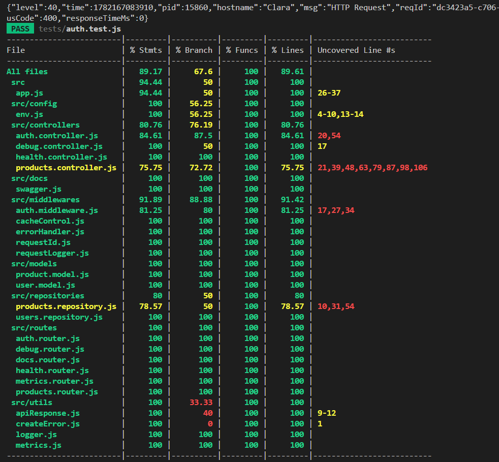
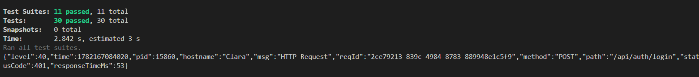
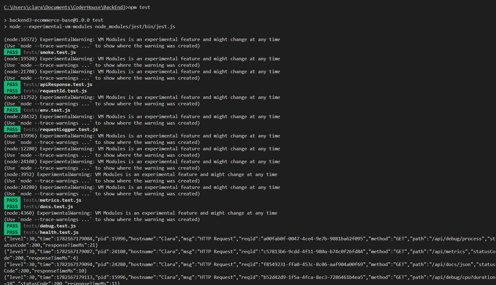
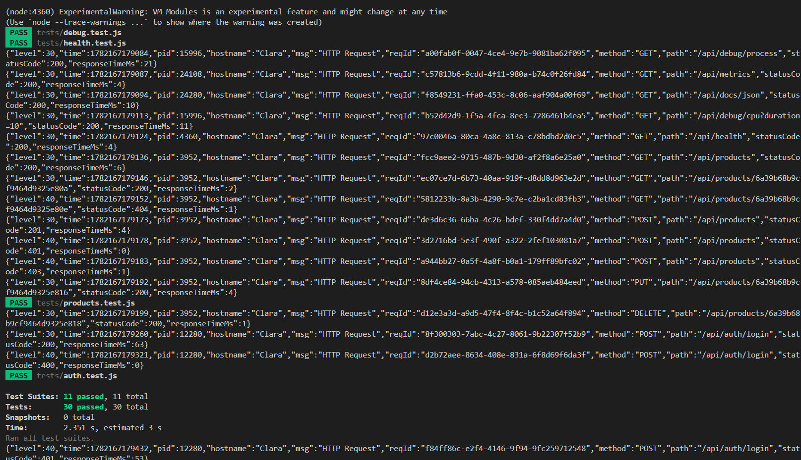
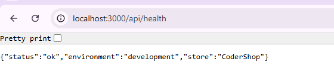
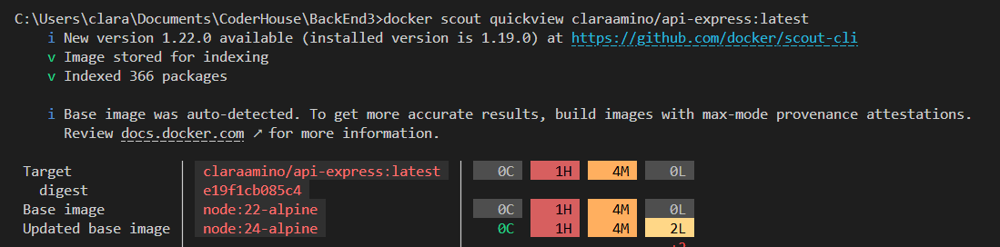

# Backend3 - API E-commerce (Express + MongoDB)

Resumen
-------
- **Repositorio de Código (GitHub):** [https://github.com/ClaraMino1/Express-API-3](https://github.com/ClaraMino1/Express-API-3)

- **APLICACIÓN DESPLEGADA:** [https://express-api-production-ed9a.up.railway.app/api/health](https://express-api-production-ed9a.up.railway.app/api/health)


Proyecto Backend para una API de e-commerce construida con Express y MongoDB. Provee endpoints para productos, autenticación (JWT) y métricas. Incluye seeds de ejemplo, modos de ejecución (desarrollo, producción y cluster) y tests.

Tecnologías
-----------

- Node.js
- Express
- MongoDB (Mongoose)
- JWT (`jsonwebtoken`)
- Bcrypt (`bcryptjs`)
- Pino (logging)
- Swagger (documentación)

Requisitos
----------

- Node.js 18+ o compatible
- MongoDB corriendo (local o remoto)
- Docker

Instalación
-----------


Instalar dependencias

```bash
npm install
```

Variables de entorno (.env)
---------------------------

Crea un archivo `.env` en la raíz con al menos las siguientes variables para desarrollo:

```env
PORT=3000
NODE_ENV=development
MONGO_URI=mongodb://127.0.0.1:27017/backend3-ecommerce
MONGO_URI_TEST=mongodb://127.0.0.1:27017/backend3-ecommerce-test
JWT_SECRET=dev-secret
JWT_EXPIRES_IN=1h
SEED_DB=true
CLUSTER_WORKERS=2
MAINTENANCE=false
```

Comandos útiles
---------------

- Desarrollo: `npm run dev`
- Producción: `npm start`
- Iniciar en modo cluster: `npm run start:cluster`
- Tests: `npm test`
 `npm run test:coverage`

Seeds
-----

Si `NODE_ENV=development` y `SEED_DB=true`, al iniciar la aplicación se insertarán seeds de ejemplo:

- Usuarios: admin (`admin@coder.com`) y user (`user@coder.com`) — contraseñas en los seeds (hasheadas).
- Productos de ejemplo

Rutas y endpoints principales
-----------------------------

Nota: las rutas están montadas bajo `/api`.

- `GET /api/health` — Estado del servidor. ([src/controllers/health.controller.js](src/controllers/health.controller.js))
- `GET /api/products` — Listar productos. ([src/controllers/products.controller.js](src/controllers/products.controller.js))
- `GET /api/products/:pid` — Obtener producto por ID.
- `POST /api/products` — Crear producto (requiere role `admin`).
- `PUT /api/products/:pid` — Actualizar producto (admin).
- `DELETE /api/products/:pid` — Eliminar producto (admin).
- `POST /api/auth` — Login, devuelve JWT. ([src/controllers/auth.controller.js](src/controllers/auth.controller.js))
- `GET /api/metrics` — Métricas
- Rutas de debug: `/api/debug/process`, `/api/debug/cpu` ([src/controllers/debug.controller.js](src/controllers/debug.controller.js)).

Autenticación y roles
---------------------

Se usa JWT para autenticación. Los controles de acceso en endpoints críticos (crear/editar/eliminar productos) validan el `role` del usuario (`admin` o `user`). Define `JWT_SECRET` en producción con un valor seguro.

Modelos y repositorios
----------------------

- `User` ([src/models/user.model.js](src/models/user.model.js)) — username, email, password (hasheada), role.
- `Product` ([src/models/product.model.js](src/models/product.model.js)) — title, price, stock, timestamps.
- Repositorios en [src/repositories](src/repositories) encapsulan acceso a datos.

Configuración
-------------

- Conexión a MongoDB: [src/config/db.js](src/config/db.js)
- Variables y defaults: [src/config/env.js](src/config/env.js)

Tests
-----

Incluye pruebas unitarias y de integración para utilidades, middlewares y endpoints principales.

Ejecutar tests:

```bash
npm test
npm run test:coverage
```

Docker
------

El proyecto está contenedorizado y la imagen optimizada para producción se encuentra disponible públicamente en Docker Hub.

- **URL Pública de la imagen:** [https://hub.docker.com/repository/docker/claraamino/api-express/general](https://hub.docker.com/repository/docker/claraamino/api-express/general)


Incluye `Dockerfile` para construir una imagen de producción ligera. Para crear y ejecutar:

```bash
docker build -t backend3:latest .
docker run -e MONGO_URI="<mongo-uri>" -e JWT_SECRET="<secret>" -p 3000:3000 backend3:latest
```

Logs y métricas
---------------

El proyecto usa Pino para logging y `prom-client` para exponer métricas. Endpoint de métricas: `/api/metrics`.


Evidencia de Tests
--------------------

### 1. Ejecución de Tests y Coverage
A continuación se muestra el resultado de la ejecución exitosa de los tests








### 2. Contenedor Docker en Ejecución
Evidencia de la aplicación corriendo correctamente dentro del contenedor Docker y respondiendo al endpoint de `health`:



### 3. Escaneo de Seguridad (Docker Scout)
Resultado del análisis básico de vulnerabilidades realizado sobre la imagen subida:

